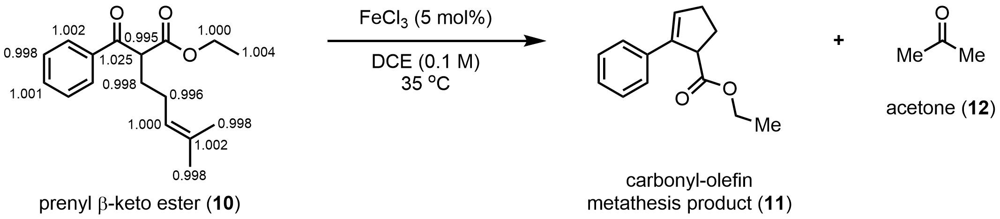
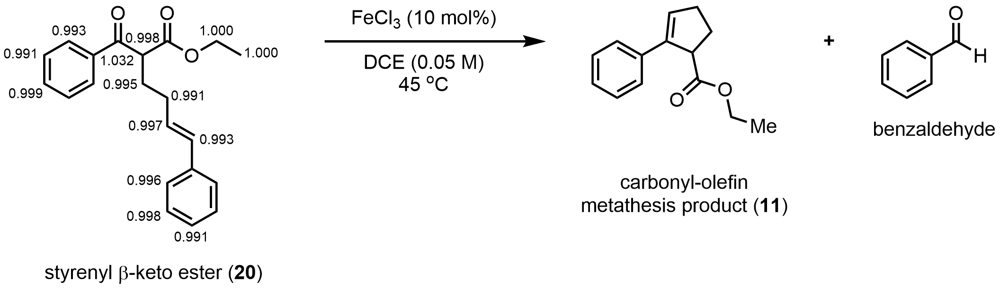

# Natural Abundance KIE Measurements via NMR

This directory contains all the files that are needed to measure carbon KIEs via DEPT NMR.

### The Experiments

Carbon KIEs were measured at natural abundance using [DEPT](https://pubs.acs.org/doi/10.1021/jacs.6b10621) for two reactions:

### Contents

- __`acquisition/`__ acquiring DEPT NMR data
	- `eek_multi_DEPT` Bruker pulse sequence file for DEPT
	- `eek_multi_DEPT.py` TopSpin Python program for running multiple samples
	- `README.md` instructions for installing and running DEPT experiments in TopSpin
- __`processing/`__ converting raw NMR data to peak integrals
	- `prenyl/` raw data and Jupyter notebooks for prenyl substrate
	- `styrenyl/` raw data and Jupyter notebooks for styrenyl substrate
	- `README.md` how to reference and phase spectra in TopSpin and how to process all data as a batch in Jupyter Lab
- __`analysis/`__ calculating KIEs and error bars

### Note on Raw Data

Due to file size limitations, it was not possible to include all of the raw data files here.  Only one block of acquisitions is included for each substrate.  The other blocks can be provided on request.

