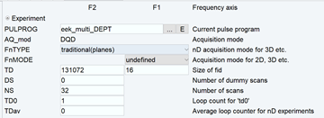

# NMR Data Acquisition

### Introduction

Kinetic isotope effects (KIEs) are powerful tools for studying the mechanisms of organic reactions.  Carbon KIEs are particularly useful because they can both be measured and predicted with high precision.  In this folder, we explain how the [DEPT](https://pubs.acs.org/doi/10.1021/jacs.6b10621) NMR technique can be used to measure carbon KIEs at natural abundance.

### Experimental Design

There are a number of ways to measure carbon KIEs, but the main way which we'll discuss here is via intermolecular competition.  The idea is to run the reaction to partial conversion, such that the starting material is enriched in the slower isotope and the product is enriched in the faster isotope.  This process of isotopic enrichment is called *fractionation*.

In principle, we could quantify either the starting material or product at any conversion.  However, the degree of fractionation affects the signal that can be measured by NMR.  As it turns out, measuring fractionation in the product at low conversion or remaining starting material at high conversion gives the biggest fractionation, and hence, largest signal.  In this paper, we looked at the latter case.

So, to measure fractionation, we need two kinds of samples (both starting from the same batch): unreacted starting material and recovered starting material.  We also need to measure the conversion using any method (NMR, HPLC, or whatever you favorite method is).  We then use DEPT to measure the amount of carbon-13 in both samples and compare the two to get fractionation.

Typically, to ensure that the results are accurate, we run duplicates such that two reactions are independently run to high conversion and assayed against two different samples of unreacted starting material.  Ideally, the KIEs will not differ too much, regardless of which pairwise comparison is made.  In fact, these pairwise checks serve as an internal control.

### Preparing for the Experiment

Before beginning, we generally ensure that the analyte has protonated carbons of sufficient chemical shift dispersion such that all peaks of interest can be resolved.  The DEPT NMR parameters are then [optimized](https://github.com/ekwan/PyKIE/tree/master/Data_Acquisition) for the given analyte.  Proton T1 values are measured so that the repetition delay can be set long enough (>5T1) for accurate integrations.  Of course, this affects the NMR acquisition time.  (Note that a significant advantage of DEPT over single-pulse carbon-13 NMR is that we can depend on the much shorter relaxation time of 1H vs. 13C.

To minimize the acquisition time, we prepare samples with 0.5-2.0 mM Cr(acac)3 as a paramagnetic relaxation agent.  The exact concentration is selected to reduce the 1H relaxation times significantly without significantly increasing the linewidth.  (This is an improvement to the protocol that we published in 2017.)  T1 values can be measured using a standard inversion recovery experiment.

For standard 5 mm Bruker probes, we use samples containing a total volume of ~500 uL.  Carbon-optimized (i.e. direct detection probes) are best, though proton-optimized probes also work.  Cryoprobes are helpful but not required.  We did not have one available for this project.

### Sources of Error and Randomized Blocks

There are many possible sources of error in this experiment.  Under optimized conditions, the largest source of random error is NMR noise and the largest sources of systematic error are sample changes and environmental conditions.  The amount of NMR noise is dependent on spectrometer sensitivty (e.g., field strength and probe construction) and the quantity of sample.  For this project, we used 100 mg samples and recorded about five days worth of data (over two acquisition periods).  We were likely close to convergence within one day.

The systematic error is generally much more serious.  The sensitivity of the NMR spectrometer is proportional to temperature (for various reasons, but one of them is that the Boltzmann population difference, and therefore the signal, depends on temperature).  Even half a degree Celsius can make a big difference.  We have unpublished data showing a remarkable correlation between the size of the NMR integral and the temperature in the room!  Furthermore, experiments show that simply inserting and ejecting the same sample, and repeating shimming, can change the integral significantly.

Since these kinds of systematic error cannot be easily controlled, we employ a randomized blocking procedure in which the four samples are acquired in a random order.  For example: ACBD, DBCA, BCAD, ...  This ensures that the influence of time-dependent errors are minimized.  A Python script (discussed below) automatically implements this procedure.  It works best with an auto-sampler.

In general, the results are not sensitive to the type of glass used in the NMR tube, shimming quality (within reason), spectrum phasing, or the way the integrals are cut (as long as everything is done consistently).  However, any significant disruption to the NMR lineshape, such as sidebands caused by spinning, dewar vibrations, or ground noise will ruin these experiments.  Nonetheless, the experiments are quite robust and this robustness is an appealing feature of DEPT as a method for determining isotopic fractionation.

### Bruker Installation

- __Pulse Sequence File__ 
	Copy `eek_multi_DEPT` into the user pulse program folder.  The DEPT read angle can be adjusted by changing this statement: `"p5=p3*0.6742"`.  The angle is given as a fraction of 90 degrees.  The experiment is run as a pseudo-2D experiment.
	
- __Parameter Set__ 
	A parameter set is not included here because it is spectrometer-dependent.  Load a standard DEPT-45 experiment and increase the dimension from 1D to 2D.  The number of pseudo-increments will determine how many blocks get run per acquisition.
	
- __Python Script__ 
	Copy `eek_multi_DEPT.py` into the user Python program folder.  This program is designed to implement randomized block sampling with a Bruker autosampler.

### Setting up the Experiments

1. Insert one of the samples: `sx 1`, where 1 is the carousel position of the sample.
2. Create a new proton experiment in folder 1.
3. Lock: `lock cdcl3`
4. Shim: `topshim`
5. Tune and Match: `atma`
6. Calibrate pulses: `pulsecal`.  Note the high-power values (for proton).
6. Create a new carbon experiment in folder 2.
7. Tune and Match: `atma`
8. Calibrate pulses: `pulsecal c13`.  Note the high-power values (for carbon).
9. Setup a DEPT experiment in folder 3 (using `eek_multi_DEPT`).
10. Set the `p3` parameter to the 90 degree proton pulse width and the `p1` parameter to the 90 degree carbon pulse width.
11. Set the relaxation delay (`D1`) and one-bond carbon-proton coupling constant (`cnst2`) parameters.
12. Set the number of scans (`NS`) to 32 and `TD` in F1 to 1.  This latter value is the number of blocks to sample per acquisition.
13. Collect a sample spectrum and verify that it looks reasonable.
14. Set the desired number of blocks as in step 12:

15. You can check the time per experiment by typing `expt` or pressing the stopwatch button.

### Automated Data Acquisition

Set the following in `eek_multi_DEPT.py`:

- `user_dir`: The folder containing the template experiments.
- `log_filename`: Status updates for the randomized block acquisition will be written here.  Use `tail -f` (on Linux) to stay apprised.
- `lock_solvent`: Usually `cdcl3` or any of the other choices from the `lock` dialog.
- `shimming_command`: This is the command that TopSpin will use to shim with.  `topshim` is usually sufficient if the starting shims are acceptable.
- `stabilization_time`: The time in seconds to wait between the completion of shimming and the beginning of data acquisition.  This gives the system time to even out temperature fluctuations.  300 s (5 minutes) is safe.
- `repetitions`: How many super-blocks to run; that is, how many times each sample should be run.
- `randomize_order`: Whether to acquire samples in the given order or a random order.  Recommended value is `True`.
- `starting_target_expno`: New data will be stored starting at this number.  Please make sure that nothing is there already, or the script could get confused.
- `template_experiment_name`: Which experiment folder contains the DEPT experiment that is to be run repeatedly.
- `template_experiment_map`: Which experiment numbers inside the template folder contain the experiments to run repeatedly.
- `target_experiment_map`: Which samples to run repeatedly and what carousel position each is in.

You can use the `edpy` command to perform the edits.  When satisfied, press the execute button to start the script.

To abort a run, use the `kill` command and terminate the Python process (and not other processes!).  We do not use incomplete superblocks.

