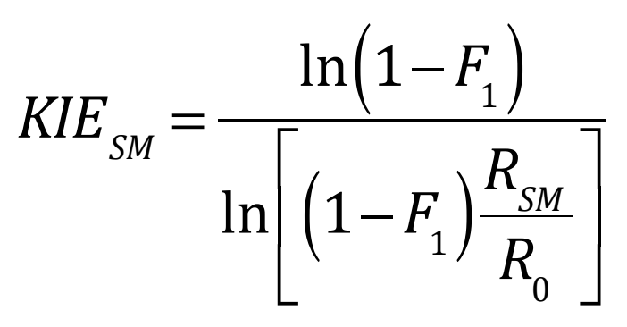

# KIE Analysis

This directory contains spreadsheets to calculate KIEs and error bars from the DEPT integrals and standard deviations.  The calculations are based on this equation:

where F1 is the conversion of the light isotope, RSM is the isotope ratio in the recovered starting material, and R0 is the isotope ratio in the unreacted starting material.  In carbon KIEs, the conversion of both isotopes is essentially the same, so we assume F = F1.  The isotope ratios R are defined as heavy divided by light.

The spreadsheets here take the tables from the Jupyter Notebooks and compute the KIEs and estimate their uncertainties.  These estimates are consistently lower than the spread between the two independent KIE measurements are thus likely too optimistic.  The most plausible explanation is that sample-dependent errors are more serious than random errors.

### Contents

- `Prenyl KIE Spreadsheet.xlsx` KIEs and errors for prenyl substrate
- `Styrenyl KIE Spreadsheet.xlsx` KIEs and errors for styrenyl substrate