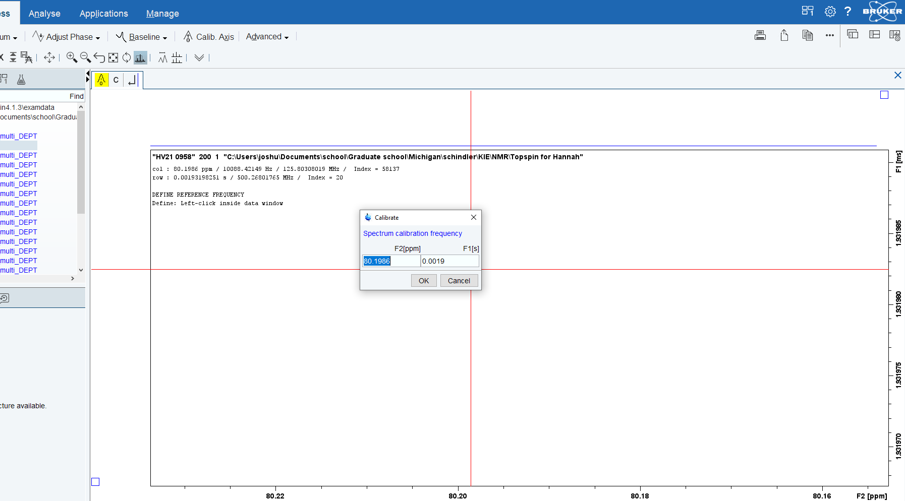

# NMR Data Processing

### Introduction

The data from the DEPT experiments is processed in two stages.  First, TopSpin is used to reference and phase the spectra.  Then, Python (via Jupyter Lab) is used to perform Fourier transforms, baseline correction, and integration.  The final results are summarized into a table that can then be pasted into Excel spreadsheets to calculate the KIEs (see analysis folder).

### Contents

- `prenyl/` prenyl substrate
	- `*.ipynb` one Python notebook for each sample
	- `Prenyl*/` raw data folders*
	
- `styrenyl/` prenyl substrate
	- `*.ipynb` one Python notebook for each sample
	- `Prenyl*/` raw data folders*

* Not all of the raw data files have been provided here for space reasons.  Please email us to get all the files if you need them.  The notebooks given here will run fine with the data subset provided.

### TopSpin Instructions

Here, we will perform some rough phasing and reference the chemical shifts.

- __Installation__
	- [TopSpin](https://www.bruker.com/protected/en/services/software-downloads/nmr/nmr-topspin-license-for-academia.html) is freely available for academics.

- __Open Data Files__ 
	
	- Navigate to the data folder of interest.
	- Double click on the sub-folder to open it ("1" in the figure above).

- __Phase__
	- `xf2` to Fourier transform.
	- `rsr 1` to open the first spectrum.
	- `.ph` to enter the phasing mode.
	- Drag up or down on the "0" or "1" buttons to adjust the zeroth- and first-order phases, respectively.
	- Use the triangular buttons to raise or lower the mouse sensitivity.
	- When satisfied with the phases, click the disk button with "nD" and the return sign on it.  This will save the phases for the 2D spectrum.
	- Click the X in the upper right to close the temporary spectrum. (Do not quit TopSpin!  This is the X for the spectrum window, not the TopSpin window.)
	- `xf2` again will show the updated phases.  They are automatically saved to disk.

- __Reference__

	 
	- Referencing is needed for all samples because small differences in sample concentration or preparation can lead to changes in chemical shifts.  Referencing ensures that all integral regions are consistent.
	- Click on the "Process" tab and press "Calib. Axis" to reference the selected spot.
	- Changes are automatically saved to the processed data folder (`pdata/`).  This is the folder that Jupyter Lab will read in the next section.

### Jupyter Lab

- __Installation__
	- You will need a virtual environment with `nmrglue`, `numpy`, `matplotlib`, and `pandas`.  Please consult any standard documentation about how to get Jupyter Lab up and running with these dependencies.
	- There's one notebook per sample.

- __Select Data Files__
	
	- Adjust the file pattern here so that it captures all the folders containing data from the sample of interest.
	- You may need to use forward slashes (Mac or Linux) or backslashes (possibly double backslashes, PC) depending on your platform.

- __Create Peaks__
	
	 - Run the next cells.
	 - The figure above shows the regions that will be integrated as parallel lists.
	 - Each peak can be phased independently.

- __Check Baseline__ 
	
	- A polynomial of `order=1` will be fit to non-peak regions.  Thus, it is important to integrate all significant peaks, regardless of whether they are of interest.
	- Non-peak regions below `clip_below` and above `clip_above` will be ignored for the purposes of baseline correction.  Be sure to set these parameters appropriately.

- __Run Integration__ 
 	
 	- This code will run the integration.
 	- Integrals are reported in arbitrary units.  You can adjust the scaling factor here, but be sure to use the same scaling factor for all the notebooks.
 	
- __Display Summary__
	
	- The last cell will display the results.
	- Copy these cells into Excel to run the KIE analysis (see analysis section).